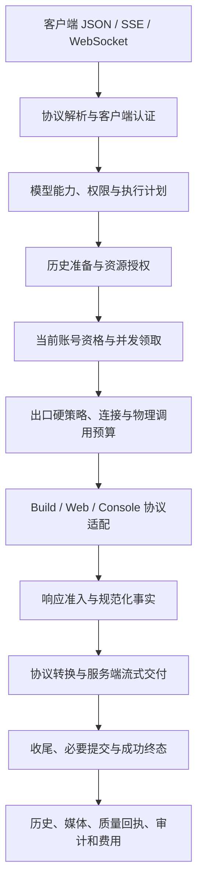

# Grok2API 架构与职责边界

Grok2API 是带 React 管理端的多账号、多 Provider API 网关。后端采用模块化单体：一个组合根装配服务，业务模块各自维护规则和状态，通过接口协作。模块是职责划分，不要求每个模块对应一个目录或独立进程。

本文说明当前结构；功能定位、扩展步骤、测试、数据迁移和分发要求见 [开发指南](DEVELOPMENT.md)。AI 开发者从 [AGENTS.md](AGENTS.md) 开始。文档不保存个人工作日志、阶段验收报告或运行数据。

## 代码分层

```text
backend/cmd/grok2api/          进程入口
backend/internal/app/         组合根、启动、后台监督、排空和关闭
backend/internal/transport/   HTTP/JSON/SSE/WebSocket 边界
backend/internal/application/ 用例编排、业务命令、后台政策
backend/internal/domain/      领域类型、纯规则、状态转换
backend/internal/repository/  持久化和共享状态端口
backend/internal/port/         内圈端口；Provider 合同、物理调用收据与 crypto 合同
backend/internal/infra/       Provider、SQL、Redis、网络、媒体、安全实现
backend/internal/quality/     质量准入、证据、实验、案件及其持久化
backend/internal/pkg/         有限职责的技术原语
backend/internal/architecture/ 可执行依赖与写入口约束
frontend/src/app/             应用壳层、认证边界、路由
frontend/src/features/        按业务组织的页面与交互
frontend/src/entities/        跨页面 DTO 和查询接口
frontend/src/shared/          API、会话、组件、壳层翻译和通用工具；feature 文案由 app 注册；shadcn 在 shared/ui
```

依赖方向为 Transport → Application → Domain；Repository 与 `port/` 定义内圈合同，Infra 实现机制，App 负责装配。Domain 不依赖 HTTP、GORM、Redis 或具体 Provider。`quality/` 是具有内部层次的业务子系统，不能仅凭目录位置把它当作技术工具包。实际允许的依赖由[架构测试](backend/internal/architecture/boundaries_test.go)约束；下表只列当前合同的关键归属。

### 内圈端口（port/）

- `port/provider`：上游能力合同（错误分类、DTO、Adapter 小接口、Registry 操作类型、历史与标记）。Responses 方言的账号探测解释（`responses_probe.go`）与 `pkg/responsecheck` 的三家协议完成语义（OpenAI/Responses/Anthropic 终止判定）、`pkg/jsonpeek` 的 SSE 事件类型表是**已记录的共享协议原语例外**：它们被 port、infra 与 gateway 三方共同消费，位置由依赖方向决定，不属于 Provider 方言私产；方言私有的解析与 body 包装仍在 `infra/provider/{cli,web,console}`。
- `port/physical`：物理调用记账合同（`Journal` 的 reserve/observe/facts/confirm 值级方法、`JournalFactory`、attempt 预算与 context 携带）。可变账本实现在 application/execution，HTTP body 包装与传输侧记录在 infra/egress；组合根注入 factory，context 只携带合同，不存在第二套账本入口。
- `port/crypto`：凭据加解密、口令哈希/校验、管理员 access token 与随机 token 合同（Cryptor/PasswordHasher/AdminTokenManager/TokenSource）。AES/JWT/bcrypt/随机源实现在 infra/security；确定性摘要在 pkg/tokenhash；客户端 Key 的 g2a 格式规则在 domain/clientkey。
- `port/lifecycle`：关闭取消判定。

### 执行域归属（application/）

- **gateway**：逻辑请求编排、总预算、delivery/completion。导出面是 `selector.Lease` / `selector.AttemptResources` 与 `Result.BeginDelivery`/`CommitCompletion`（gateway 不转发 selector 类型）。执行失败事实（错误分类、归因、公开文案与 HTTP 状态）由 gateway 的 failure 投影给出，`transport/http/inference/client_error.go` 负责把这些事实转成协议形状并处理 OpenAI/Anthropic 差异。物理调用预算由 `domain/inference` 的 attempt budget 表达，组合根在执行入口装配；物理收据账本归 `port/physical` 与 `application/execution`。
- **selector**：候选/资格/原子领取与 CAS；消费方合同 RoutingStore（路由候选/凭据材料/条件写），不含视频完成函数，gateway 不再转发 selector 类型。
- **admission**：准入等待、guard 快照与换号预算。
- **mediajob**：图片/视频/语音生成事实与视频物理预算；不持有 gateway.Service。媒体后台执行状态（队列/去重集合/worker/输入槽位/额度恢复游标）由 gateway 内 mediaBackground 组件单一持有，gateway.Service 不再声明这些字段。
- **account**：凭据代际、刷新、拒绝与冷却观察（`service.go`）；额度/账单刷新在 `quota.go`；`Execution` 是 gateway 可见的全部账号运行时（凭据代际、额度观察、限流调和），导入/转换/管理列表不在其上。账号材料、导入/导出、转换、管理修改共享同一凭据代际与生命周期 owner；`capabilities.go` 暴露 `Administration`、`CredentialTransfer`、`Conversion`、`Maintenance` 能力，HTTP 不持有完整 `*account.Service`。导入/转换后的初始同步流水线由 `accountsync.Onboarding` 编排，调用结束前取消并等待同步 worker。Refresh 错误可恢复性、诊断文本清洗与额度模式分类（`IsWebChatQuotaMode` 等）由 `domain/account` 拥有。

### 组合根与例外

- 装配映射在 `app/wire_quality.go` / `wire_egress.go` / `wire_providers.go` / `wire_settings.go`，不承载资格/冻结规则；管理面 egress 运行时快照由 `application/egress.LiveStats` 注入 HTTP。
- 运行设置边界：`application/settings` 只持有 `domain/settings` 快照；组合根注入完整快照校验及旧持久值的文件基线解析。旧值解析在发布重载快照之前完成，当前编辑输入不使用旧数据缺省规则修复非法值。
- 版本查询由 `application/updatecheck` 拥有版本比较、快照和合并检查；GitHub URL、请求头、响应限额和 body 关闭归 `infra/updatecheck`，通过 `ReleaseSource` 注入。
- 质量流程由 `court` / `investigator` / `events` / `enforcement` / `management` 拥有；案件、实验、事件、统计快照与纯规则归 `quality/model`；`registry` / `journal` / `evidence` 是存储及投影实现。用例不能导入这三个存储包，组合根注入消费方定义的接口。法院只在本次动作确实把账号从羁押变为可用时通知账号轴清除质量标记与瞬态冷却；账号仍被其它案件羁押则不通知。
- `account` 保留单一状态 owner。能力接口限制消费者可调用范围，并不表示导入、管理、刷新已成为独立服务。没有独立状态和生命周期的转发包不作为架构分层。

### 前端 FSD

- 依赖方向 app → features → entities → shared；**feature 之间不互相 import**（页面组合一律在 app 层完成，如 `app/quality-settings-route.tsx` 注入设置表单运行时、deferred-pages 组装状态横幅）。
- `shared/` 不 import entities/features/app；`entities/` 不 import features/app；shadcn 与通用运营件在 `shared/ui`；时长原语在 `shared/lib/duration`；设置表单模型、时长输入与应用状态徽章在 `entities/settings`；节点投影与按域查询 hooks 在 `entities/{egress,account,guard}`；代理/订阅 URL 校验在 `entities/egress/proxy-url`。
- 边界由 `frontend/src/app/fsd-boundaries.test.ts`（解析静态、动态、类型、重导出和副作用依赖，覆盖别名与相对路径）强制，eslint restricted-imports 提供别名导入的即时检查。
- Inference/account HTTP 不引用 `provider.VideoOperation` / thinking marker / TTS DTO；标记合同在 `domain/inference`。Account HTTP 按用例拆文件（query/admin/import_export/conversion/refresh/device，另有 handler 装配、web_settings、web_account_scripts 与 SSE stream），handler 接收组合根装配的能力，负责路由、投影与共享错误映射；导入/转换流水线不在 HTTP 内启动同步 goroutine。

## 整体协作与子模块所有权

模块化单体的顶层按决定权分成执行、账号与目录、身份与计量、历史与资源、网络、质量、配置与运维七组。组合根装配各组，任何一组都不能通过共享数据库句柄绕过另一组的命令。

| 子系统 | 入口与协调者 | 内部职责划分 | 权威状态与关键边界 |
| --- | --- | --- | --- |
| 请求执行 | `gateway` | `selector` 选号与领取；`admission` 等待与重试准入；`mediajob` 媒体生成事实；gateway 协调 delivery/completion | attempt budget、资源租约与完成事实分别持有；子模块不反向依赖 gateway |
| 账号与目录 | `account`、`accountsync`、`model` | account 的 admin/import/conversion/device/credential/quota 文件负责对应命令；accountsync 补齐初始快照；model 发布能力与路由 | account 统一执行凭据/身份条件写与共享刷新；model 持有目录状态；管理能力不能流入执行接口 |
| 身份与计量 | `adminauth`、`clientkey`、`audit` | 管理会话与客户端 Key 独立；clientkey 授权和费用预留；audit 结算、待写及保留 | 已接受工作、计费身份和展示审计相互独立，删除展示记录不解除结算义务 |
| 历史与资源 | `history`、`media` | history 拥有 lineage、scope 与恢复提案；media 拥有本地资产、归属和清理；Provider 解释上游语义 | 使用资源时重新授权；暂存、claim 和归档交接显式，不能只依赖请求入口鉴权 |
| 网络 | `application/egress`、`infra/egress` | 管理面拥有节点、池、路由、订阅与轮换政策；运行时按 routing/client/clearance/health/task 分持状态 | binding/epoch、探测版本、连接容量分别维护；管理写入通过事务端口，活跃资源在 EOF/取消/关闭时释放 |
| 质量 | `guard`、`court`、`investigator`、`events`、`enforcement`、`management`、`proxy` | guard 决定响应准入；court 决定实验与裁决；investigator 执行；events 消费持久回执；enforcement 执行出口处置；management 管理配置与读投影；proxy 只读节点画像与拨号分布 | model 不含 SQL；registry 原子维护案件与限制；journal 保存事实与 outbox；evidence 保存观测并发布窗口；选路仍在 infra/egress |
| 配置与运维 | `settings`、`invalidation`、`dashboard`、`updatecheck`、`app` | settings 负责 revision/CAS/apply；通知只加速收敛；dashboard 聚合只读；app 监督进程生命周期 | 文件基线、持久意图、本实例已应用版本分开；关闭先等待生产者，再关闭 writer/网络/数据库 |

质量内部跨存储边界的共享事实定义在 `quality/model`。比如 court 的 `StateStore` 表达原子立案、解除和结案，`ProbeReader` 只读取有限实验记录；它们不能暴露 `DB()` 或自行构造 `ProbeTaskStore`。存储实现仍须在事务内复核协调租约、当前身份与状态，接口隔离不替代并发正确性。

前端 app 组合路由与 feature；feature 持有页面交互、草稿和取消；entities 提供跨页 DTO、解码、查询与 API；shared 管理通用请求、会话和组件。一个大页面内部可包含多个交互单元，但不能通过跨 feature 导入形成隐式用例编排。

### 当前仍然集中的实现边界

以下位置有明确 owner，但尚未做到完全的策略与机制分离。新增功能应沿对应边界收敛，不把当前集中实现推广为通用模式。其中已收敛的条目记录当前合同，回归即为缺陷：

- `account.Service` 仍持有多组刷新、额度、转换与维护状态。进一步拆实现时先定义共享凭据写入、OperationGroup、池和关闭的归属，再迁移完整用例；仅增加转发服务不能减少耦合。
- 额度恢复的资格与时机判定收敛到 `domain/account` 的单一谓词（含 `IsConsoleUsageQuotaMode` 与固定 24 小时 Console 预测窗口）：存储层只返回候选行，组合根不重新解释业务规则。`quotarecovery.Run` 单独持有到期扫描游标，按 reset 时间、账号和模式每轮推进至多 1,000 条，扫描结束后回绕；不符合资格或仍耗尽的队首不能永久阻塞后续账号。Web 启动恢复先筛 Provider 再限量，不逐账号加载完整凭据。`account.RunQuotaRefresh` 与 `quotarecovery.Run` 是两个不同角色的循环（内存脏队列即时刷新 / 持久队列两次确认恢复），共享同一谓词但生命周期独立，不合并为单一循环。
- `application/selector` 的瞬态故障判定已收敛到 `repository.StoreFaultKindOf` 与 `repository.StoreFaultTransient`（驱动级 SQLSTATE/SQLite 码分类在 `infra/persistence/relational/errors.go`），selector 只决定是否允许过期快照或换候选；取消、截止和业务冲突不能被统一当作可重试，约束冲突与未归类故障是确定性结果，任何消费方都不得把它们当瞬态。新增驱动方言时扩展存储层分类，不在 selector 识别驱动细节。
- `infra/egress` 的池模式判定、冷却豁免与轮换端点健康投影收敛到 `domain/egress`（`IsPoolMode`、`CooldownBlocksScheduling`、`RotatingEndpointHealth`）：`exit_ip_quality` 隔离对池模式节点同样生效，固定目标路径不再绕过它，普通冷却仍按域规则豁免。
- `application/egress` 已把订阅抓取与轮换 webhook 的传输机制移出到 `infra/egress`（`SubscriptionFetcher` / `WebhookExecutor` 端口，组合根注入，缺依赖即显式失败且无内联回退）；应用层保留订阅代际、轮换次数与重试决策。
- `port/physical` 持有收据合同和 context 携带方法，可变请求账本由 `application/execution` 持有；Provider 注册机制由 `infra/provider` 实现，`port/provider.Registry` 仅定义读取能力。共享协议解析例外见上文。一个请求内只有一个物理计数和收据 owner，不能通过多套 context 或账本重复计量。
- 通用设置的完整校验仍与文件配置适配结合；领域规则继续收敛到 `domain/settings`，文件、环境覆盖与旧数据解析留在 `infra/config`。设置迁移不能把当前非法输入按旧数据缺省值修复。
- 少数生产文件带有跨包导出接缝（`gateway/guard_snapshot.go`、`gateway/history_recovery.go`、`selector/export.go`、`infra/provider/{console,web}/catalog.go`、`quality/guard/export.go`、`domain/model/export.go`、`infra/egress/manager_test_seam.go`）。它们包装同包未导出状态，无法迁入 `_test.go`——Go 的测试文件只对本包测试可见；迁入 `testsupport` 则要额外导出被包装的内部状态，反而扩大生产 API。`selector/export.go` 同时是 gateway 的生产转发面（租约资源、admission body、选号会话、探针候选）和测试接缝（`StickySessionKey`、`ReplaceAccountStore`、`LocalQualityAllowed`）。`infra/egress.WithPinnedNode` 是 live-test/debug 钉住入口，与生产 `WithQualityVerificationNode` 分开，不列入冻结文件（所在 `trace.go` 还有生产 API）。约束：`TestTestSeamSurfaceIsFrozen` 冻结接缝清单（新增/删除必须改清单并进入评审；检查覆盖 TYPE/FUNC 与导出 CONST/VAR），`TestForwardingOnlySeamFilesCarryNoStateOrPolicy` 要求纯转发文件只做单语句转发、不持状态、不含控制流。另有少量接口方法级的测试种子面（如 `repository.AccountRepository.UpsertByIdentity`，生产导入走 `ImportAccounts`）在接口注释中显式声明。新增功能不得扩大接缝面；同包内可迁移的接缝必须移入 `_test.go`。

## 请求如何经过系统



执行器根据失败类型、权限、剩余期限和总预算决定有限重试。恢复、压缩、连接重试和控制调用同样需要明确的物理预算。已经交付的流不能拼接另一次生成；上游可能已经接受的作业不能被无声重新生成。

准入通过、生成完成、历史提交、资源归属、服务端写出、质量回执和账本提交是独立事实。必要提交应在成功终态之前完成；客户端断开可能发生在生成已接受之后。服务端成功写出也不等于客户端已经消费。

图中展示主要协作关系，不表示所有响应整包缓冲后才发送：SSE/WS 的读取、转换和交付可以持续进行；结束时按完成合同处理必要提交与终态。非流式响应和异步媒体作业分别遵守各自的完成、claim 和恢复规则。

## 模块索引

下表编号仅用于稳定引用。后端路径相对 `backend/internal/`，其他位置注明。缩写路径沿用该单元格中前一个完整前缀。同包内的模块按决定权区分，避免为目录整齐增加空转发层。

| 模块 | 主入口与实现位置 | 拥有的决定权与边界 |
| --- | --- | --- |
| M01 装配与生命周期 | `app/`；`backend/cmd/grok2api/` | 构造、接线、启动、取消、等待、关闭；后台业务政策由所属服务维护 |
| M02 管理员身份 | `application/adminauth/`、`domain/admin/`、`transport/http/adminauth/`、`transport/http/adminsession/` | 密码验证与代际、登录、刷新、会话族撤销；与客户端 Key 分开 |
| M03 API 协议 | `transport/http/`，特别是 `inference/` | 输入验证、DTO、公开错误、JSON/SSE/WS 编解码；不复制调度与计费规则 |
| M04 请求执行 | `application/gateway/` 的 service、attempt、completion、delivery、image、video、voice 文件 | 逻辑请求、总预算、恢复、作业执行与完成协调；协作者分别拥有具体业务事实 |
| M05 模型目录 | `application/model/`、`domain/model/`、`application/accountsync/` | 公开名称、路由、能力、账号目录同步与可见性；Provider 提供上游能力事实 |
| M06 账号选择 | `application/selector/` | 候选、当前硬资格、选号会话与并发租约；不修改管理员意图、历史或网络政策 |
| M07 账号生命周期 | `application/account/`、`application/accountsync/`、`application/quotarecovery/`、`domain/account/` | 材料、身份、启停、健康、额度、Team 限流、导入与后台恢复；各限制维度独立 |
| M08 客户端身份与预算 | `application/clientkey/`、`domain/clientkey/`、客户端鉴权中间件 | Key 认证、模型/账号范围、并发、限流、费用预留与授权；模型候选展示不是授权 |
| M09 Build Provider | `infra/provider/cli/`、`infra/buildtransport/` | Build OAuth、上游协议、目录/Billing 事实、协议拒绝与原生历史；不暗增请求权限 |
| M10 Web Provider | `infra/provider/web/` | Web SSO、签名、额度事实、多模态协议；签名和后台任务有明确生命周期 |
| M11 Console Provider | `infra/provider/console/` | Console SSO/DPoP、文本、音视频及实时协议；使用统一资源与预算端口 |
| M12 会话连续性 | `application/history/`、`domain/history/`、Provider 历史端口 | scope、历史身份、分支、准备/提交、压缩、恢复与保留；亲和、cache hint、网络提示各自独立 |
| M13 网络运行时 | `infra/egress/`、`pkg/netbudget/`、`pkg/browsertransport/`、`pkg/proxydial/`、`pkg/tunnelproxy/` | 物理选路、资格、隔离、fresh、连接和容量、版本化观测；软提示不能绕过硬限制 |
| M14 网络管理 | `application/egress/`、`domain/egress/`、`transport/http/egress/` | 节点、来源、池、回退图、路由、订阅、探活和轮换；当前事务内检查合法关系 |
| M15 响应准入 | `quality/guard/`、`domain/guard/`、gateway 的 quality_retry / quality_retry_scan / guard 文件 | `quality/guard` 拥有策略、信号与 `Judge` 判定；`domain/guard` 拥有纯规则与默认值。执行器组织重试并持有**执行侧**准入统计与豁免计数（`gateway/guard_stats.go`，经 `transport/http/guardstats` 投影）——统计跟随实际执行路径，不由策略包持有。空流/零证据的语义判决是执行器传输策略（`quality_retry_scan.go` 的 `emptyStreamVerdict`），不经过 `Judge`，其标签随执行器维护 |
| M16 质量调查 | `quality/` 下 events、evidence、investigator、court、registry、management、enforcement | 事件、受控实验、案件、证据资格和限制；网络错误不自动成为质量票，旧身份不能限制新身份 |
| M17 媒体与资源 | `application/media/`、`domain/media/`、`infra/media/`、`infra/mediafetch/` | 输入资格、物化、暂存、资产归属、归档来源、删除和孤儿回收；执行 claim 归 M04 |
| M18 语音与实时 | gateway 的 voice 文件、`application/mediajob/voice_generation.go`、`transport/http/inference/`、各 Provider 语音实现 | gateway 拥有执行与双向通道交接，mediajob 保存独立生成事实，HTTP 编解码；费用归 M19 |
| M19 审计与计量 | `application/audit/`、`domain/audit/`、`infra/persistence/` 的审计 writer | 独立完成事实、实际用量、费用结算、持久待写与保留；删诊断详情不删除永久结算身份 |
| M20 配置与传播 | `application/settings/`、`domain/settings/`、`infra/config/` | 启动基线、持久版本、CAS/reset、逐目标 apply 和通知；guard/quality 保持独立配置文档 |
| M21 存储与共享状态 | `repository/`、`infra/persistence/relational/`、`infra/runtime/` | 事务、当前状态条件写、缓存、租约、锁和通知；实现业务命令，不另设一套业务规则 |
| M22 查询与交付工程 | `application/dashboard/`、`application/updatecheck/`、`infra/updatecheck/`、`buildinfo/`；根目录 `scripts/`、`.github/` | 聚合读快照、版本信息与构建验证；查询不绕过业务服务发起变更 |
| M23 管理前端 | 根目录 `frontend/src/` | 会话内查询、表单、交互与显示资源；后端决定持久权限和业务结果 |
| M24 技术组件 | `pkg/`、`infra/security/`、`infra/observability/` | 解析、限额、加密、错误与日志等原语；不吸收跨模块业务编排 |

## 管理与后台流程

管理员命令从前端经管理 HTTP 交给所属服务，再通过具名端口提交当前事务。配置保存携带 revision；持久化成功、本实例应用成功、其他实例收到通知和需要重启分别呈现。Redis 通知用于加速收敛，数据库仍是权威状态。

后台循环的政策归业务 owner，M01 统一监督运行与退出。模型同步、额度恢复、历史保留、质量调查、网络维护、媒体作业和审计待写都有明确的持有者。退出时先停止接收新请求，排空或取消已有 HTTP/WS，等待处理器及 worker 完成必要交接，再关闭 writer、网络和存储。关闭超时应报告未完成阶段，并遵守现有可重试关闭合同。

## 必须共同维护的合同

- 当前资格在真正领取或写入时重新检查。列表快照、缓存命中和前置检查不能替代最终 CAS、事务或原子租约。
- 凭据代际、账号身份、出口 binding/epoch、历史 scope、作业 claim 和配置 revision 各有含义，不能以通用时间戳或单个布尔值代替。
- 管理员禁用、认证失败、质量限制、网络冷却和额度不足相互独立。一次成功或一种限制的解除不能清掉其他限制。
- 资源由取得方负责释放，交接需要明确接收者；取消、EOF、失败、重复关闭和关闭期间的新请求都属于合同。
- 权限检查覆盖恢复、下载、轮询、删除及后台续作。`restricted` 空集合代表没有许可，不能回退为全部允许。
- 原始上游输出、运行数据库、凭据和调研轨迹不进入源码仓库。仅保留解释当前行为的文档、必要测试及人工构造或经审查的最小样本。

扩展规则和验证入口见 [开发指南](DEVELOPMENT.md)；网络内部合同见 [Egress runtime](backend/internal/infra/egress/README.md)，质量内部合同见 [质量调查](backend/internal/quality/README.md) 和 [响应守卫](backend/internal/quality/guard/README.md)。
