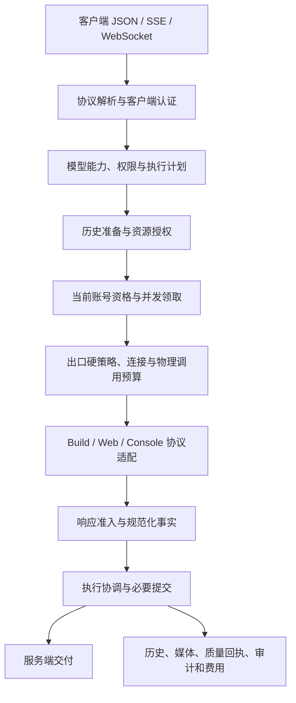

# Grok2API 架构与职责边界

Grok2API 是带 React 管理端的多账号、多 Provider API 网关。后端采用模块化单体：一个组合根装配服务，业务模块各自维护规则和状态，通过接口协作。模块是职责划分，不要求每个模块对应一个目录或独立进程。

本文说明当前结构；功能定位、扩展步骤、测试、数据迁移和分发要求见 [开发指南](DEVELOPMENT.md)。AI 开发者从 [AGENTS.md](AGENTS.md) 开始。文档不保存个人工作日志、阶段验收报告或运行数据。

## 代码分层

```text
backend/cmd/grok2api/          进程入口
backend/internal/app/         组合根、启动、后台监督、排空和关闭
backend/internal/transport/   HTTP/JSON/SSE/WebSocket 边界
backend/internal/application/ 用例编排、业务命令、后台政策
backend/internal/domain/      领域类型、纯规则、状态转换
backend/internal/repository/  持久化和共享状态端口
backend/internal/infra/       Provider、SQL、Redis、网络、媒体、安全实现
backend/internal/quality/     质量准入、证据、实验、案件及其持久化
backend/internal/pkg/         有限职责的技术原语
backend/internal/architecture/ 可执行依赖与写入口约束
frontend/src/app/             应用壳层、认证边界、路由
frontend/src/features/        按业务组织的页面与交互
frontend/src/entities/        跨页面 DTO 和查询接口
frontend/src/shared/          API、会话、组件、翻译和通用工具
```

通常依赖方向为 Transport → Application → Domain；Repository 定义接口，Infra 实现机制，App 负责装配。Domain 不依赖 HTTP、GORM、Redis 或具体 Provider。`quality/` 是具有内部层次的业务子系统，不能仅凭目录位置把它当作技术工具包。实际允许的依赖由 [架构测试](backend/internal/architecture/boundaries_test.go) 约束。

## 请求如何经过系统



执行器根据失败类型、权限、剩余期限和总预算决定有限重试。恢复、压缩、连接重试和控制调用同样需要明确的物理预算。已经交付的流不能拼接另一次生成；上游可能已经接受的作业不能被无声重新生成。

准入通过、生成完成、历史提交、资源归属、服务端写出、质量回执和账本提交是独立事实。必要提交应在成功终态之前完成；客户端断开可能发生在生成已接受之后。服务端成功写出也不等于客户端已经消费。

## 模块索引

下表编号仅用于稳定引用。后端路径相对 `backend/internal/`，其他位置注明。缩写路径沿用该单元格中前一个完整前缀。同包内的模块按决定权区分，避免为目录整齐增加空转发层。

| 模块 | 主入口与实现位置 | 拥有的决定权与边界 |
| --- | --- | --- |
| M01 装配与生命周期 | `app/`；`backend/cmd/grok2api/` | 构造、接线、启动、取消、等待、关闭；后台业务政策由所属服务维护 |
| M02 管理员身份 | `application/adminauth/`、`domain/admin/`、`transport/http/adminauth/`、`transport/http/adminsession/` | 密码验证与代际、登录、刷新、会话族撤销；与客户端 Key 分开 |
| M03 API 协议 | `transport/http/`，特别是 `inference/` | 输入验证、DTO、公开错误、JSON/SSE/WS 编解码；不复制调度与计费规则 |
| M04 请求执行 | `application/gateway/` 的 service、attempt、completion、delivery、image、video、voice 文件 | 逻辑请求、总预算、恢复、作业执行与完成协调；协作者分别拥有具体业务事实 |
| M05 模型目录 | `application/model/`、`domain/model/`、`application/accountsync/` | 公开名称、路由、能力、账号目录同步与可见性；Provider 提供上游能力事实 |
| M06 账号选择 | `application/gateway/selector*.go`、`probe_candidates.go` | 候选、当前硬资格、选号会话与并发租约；不修改管理员意图、历史或网络政策 |
| M07 账号生命周期 | `application/account/`、`application/quotarecovery/`、`domain/account/` | 材料、身份、启停、健康、额度、Team 限流、导入与后台恢复；各限制维度独立 |
| M08 客户端身份与预算 | `application/clientkey/`、`domain/clientkey/`、客户端鉴权中间件 | Key 认证、模型/账号范围、并发、限流、费用预留与授权；模型候选展示不是授权 |
| M09 Build Provider | `infra/provider/cli/`、`infra/buildtransport/` | Build OAuth、上游协议、目录/Billing 事实、协议拒绝与原生历史；不暗增请求权限 |
| M10 Web Provider | `infra/provider/web/`、`infra/rsc/` | Web SSO、签名、额度事实、多模态协议；签名和后台任务有明确生命周期 |
| M11 Console Provider | `infra/provider/console/` | Console SSO/DPoP、文本、音视频及实时协议；使用统一资源与预算端口 |
| M12 会话连续性 | `application/history/`、`domain/history/`、Provider 历史端口 | scope、历史身份、分支、准备/提交、压缩、恢复与保留；亲和、cache hint、网络提示各自独立 |
| M13 网络运行时 | `infra/egress/`、`pkg/netbudget/`、`pkg/browsertransport/`、`pkg/proxydial/`、`pkg/tunnelproxy/` | 物理选路、资格、隔离、fresh、连接和容量、版本化观测；软提示不能绕过硬限制 |
| M14 网络管理 | `application/egress/`、`domain/egress/`、`transport/http/egress/` | 节点、来源、池、回退图、路由、订阅、探活和轮换；当前事务内检查合法关系 |
| M15 响应准入 | `quality/guard/`、`domain/guard/`、gateway 的 quality_retry / guard 文件 | 策略、信号、判定和准入统计；执行器组织重试，调查系统解释证据 |
| M16 质量调查 | `quality/` 下 events、evidence、investigator、court、registry、management、enforcement | 事件、受控实验、案件、证据资格和限制；网络错误不自动成为质量票，旧身份不能限制新身份 |
| M17 媒体与资源 | `application/media/`、`domain/media/`、`infra/media/`、`infra/mediafetch/` | 输入资格、物化、暂存、资产归属、归档来源、删除和孤儿回收；执行 claim 归 M04 |
| M18 语音与实时 | gateway 的 voice 文件、`transport/http/inference/`、各 Provider 语音实现 | REST/WS 状态机、完整性、输入选项、双向通道与资源交接；费用归 M19 |
| M19 审计与计量 | `application/audit/`、`domain/audit/`、`infra/persistence/` 的审计 writer | 独立完成事实、实际用量、费用结算、持久待写与保留；删诊断详情不删除永久结算身份 |
| M20 配置与传播 | `application/settings/`、`domain/settings/`、`infra/config/` | 启动基线、持久版本、CAS/reset、逐目标 apply 和通知；guard/quality 保持独立配置文档 |
| M21 存储与共享状态 | `repository/`、`infra/persistence/relational/`、`infra/runtime/` | 事务、当前状态条件写、缓存、租约、锁和通知；实现业务命令，不另设一套业务规则 |
| M22 查询与交付工程 | `application/dashboard/`、`application/updatecheck/`、`buildinfo/`；根目录 `scripts/`、`.github/` | 聚合读快照、版本信息与构建验证；查询不绕过业务服务发起变更 |
| M23 管理前端 | 根目录 `frontend/src/` | 会话内查询、表单、交互与显示资源；后端决定持久权限和业务结果 |
| M24 技术组件 | `pkg/`、`shared/`、`infra/security/`、`infra/observability/` | 解析、限额、加密、错误与日志等原语；不吸收跨模块业务编排 |

## 管理与后台流程

管理员命令从前端经管理 HTTP 交给所属服务，再通过具名端口提交当前事务。配置保存携带 revision；持久化成功、本实例应用成功、其他实例收到通知和需要重启分别呈现。Redis 通知用于加速收敛，数据库仍是权威状态。

后台循环的政策归业务 owner，M01 统一监督运行与退出。模型同步、额度恢复、历史保留、质量调查、网络维护、媒体作业和审计待写都有明确的持有者。退出时先停止接收新请求，排空或取消已有 HTTP/WS，等待处理器及 worker 完成必要交接，再关闭 writer、网络和存储。关闭超时应报告未完成阶段，并遵守现有可重试关闭合同。

## 必须共同维护的合同

- 当前资格在真正领取或写入时重新检查。列表快照、缓存命中和前置检查不能替代最终 CAS、事务或原子租约。
- 凭据代际、账号身份、出口 binding/epoch、历史 scope、作业 claim 和配置 revision 各有含义，不能以通用时间戳或单个布尔值代替。
- 管理员禁用、认证失败、质量限制、网络冷却和额度不足相互独立。一次成功或一种限制的解除不能清掉其他限制。
- 资源由取得方负责释放，交接需要明确接收者；取消、EOF、失败、重复关闭和关闭期间的新请求都属于合同。
- 权限检查覆盖恢复、下载、轮询、删除及后台续作。`restricted` 空集合代表没有许可，不能回退为全部允许。
- 原始上游输出、运行数据库、凭据和调研轨迹不进入源码仓库。仅保留解释当前行为的文档、必要测试及人工构造或经审查的最小样本。

扩展规则和验证入口见 [开发指南](DEVELOPMENT.md)；网络内部合同见 [Egress runtime](backend/internal/infra/egress/README.md)，质量内部合同见 [质量调查](backend/internal/quality/README.md) 和 [响应守卫](backend/internal/quality/guard/README.md)。
